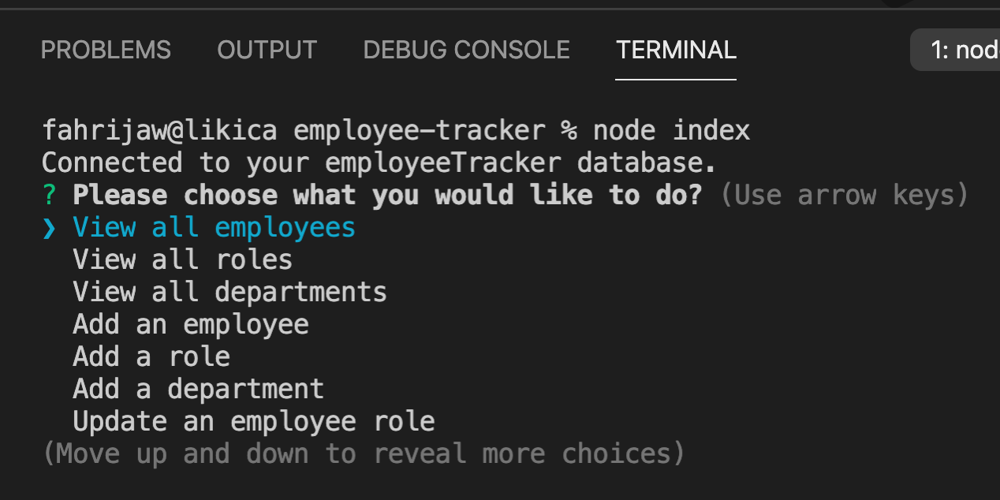

# employee-tracker
  ### By Likica * [Email me](mailto:fahrija_wyroski@live.com) * 

  * [Walk-Through Video Link](https://drive.google.com/file/d/1r0kFLJw9-rBXJqjbkkAIW3vfz40-BI1m/view)
 

    
    
    
    </a>

    
    
    
    

  ## Table of contents
  * [Description](#Description)
  * [Installation Instructions](#installation-Instructions)
  * [Usage Instructions](#Usage-Instructions)
  * [Questions](#Questions)
  * [Contributing](#Contributing)
  * [Tests](#Tests)
 
  # Description
  ##### [Back to Table of Contents](#Table-of-Contents)
  A command-line application to manage a company's employee database, using Node.js, Inquirer, and MySQL.

  ## User Story
  ##### [Back to Table of Contents](#Table-of-Contents)
  I WANT to be able to view and manage the departments, roles, and employees in my company - SO THAT I can organize and plan my business

  ## Installation Instructions
  ##### [Back to Table of Contents](#Table-of-Contents)
  1. Install node (`npm init` and `npm install --y`), install dependencies needed (inquirer, mysql2,jest), then run the MySQL Shell commands to create DB, SEED it and run `npm start` or `node index` in your Terminal/Bash

  ## Usage Instructions
  ##### [Back to Table of Contents](#Table-of-Contents)
  - Once you have installed `npm dependencies` start the app by running `npm start` or `node index` (either one will work)
  - Once started, app will prompt you with choices list (view all employees, departments or roles, as well as choices to add new employee, department or role and update the role of an employee)

  

    
  

  - View All Employees:
  

    
  

- View All Roles:
  

    
  

- View All Departments:
  

    
  

- Add an Employee:

* Step 1- enter first and last name of the new employee
  

    
  

* Step 2- choose the role and manager for this employee
    

    
  

* New Employee Added (employee with ID#12):
    

    
  

- Add a Role - Once you chose this option, app will prompt for a New Role name, salary and department this role belongs to. Once you give all required info, your new role will be added to the list of roles:
    

    
  

- Add a Department - Once you chose this option, app will prompt for a New Department name. Once you give all required info, your new department will be added to the list of departments:
    

    
  

- Update an Employee Role - Once you chose this option, app will prompt you to choose the last name of the employee changing role and give you list of role options to choose from. Once you give all required info, your employee role will be updated:
    

    
  

  ## Contributing
  ##### [Back to Table of Contents](#Table-of-Contents)
  - All are welcome to contribute within limits of below License

  ## Tests
  #### [Back to Table of Contents](#Table-of-Contents)
  1. inputCheck.test
  2. 

  ## Questions
  ##### [Back to Table of Contents](#Table-of-Contents)
  * If you have any questions, please contact me at fahrija_wyroski@live.com

  ## License 
  * License Type: MIT
    
    [License: MIT](https://opensource.org/licenses/MIT)
    Permission is hereby granted, free of charge, to any person obtaining a copy of this software and associated documentation files (the "Software"), to deal in the Software without restriction, including without limitation the rights to use, copy, modify, merge, publish, distribute, sublicense, and/or sell copies of the Software, and to permit persons to whom the Software is furnished to do so, subject to the following conditions:The above copyright notice and this permission notice shall be included in all copies or substantial portions of the Software.THE SOFTWARE IS PROVIDED "AS IS", WITHOUT WARRANTY OF ANY KIND, EXPRESS OR IMPLIED, INCLUDING BUT NOT LIMITED TO THE WARRANTIES OF MERCHANTABILITY, FITNESS FOR A PARTICULAR PURPOSE AND NONINFRINGEMENT. IN NO EVENT SHALL THE AUTHORS OR COPYRIGHT HOLDERS BE LIABLE FOR ANY CLAIM, DAMAGES OR OTHER LIABILITY, WHETHER IN AN ACTION OF CONTRACT, TORT OR OTHERWISE, ARISING FROM, OUT OF OR IN CONNECTION WITH THE SOFTWARE OR THE USE OR OTHER DEALINGS IN THE SOFTWARE.

  _This README was generated by Likica with_ ❤️ [GitHub Profile](https://github.com/likica)
 
  